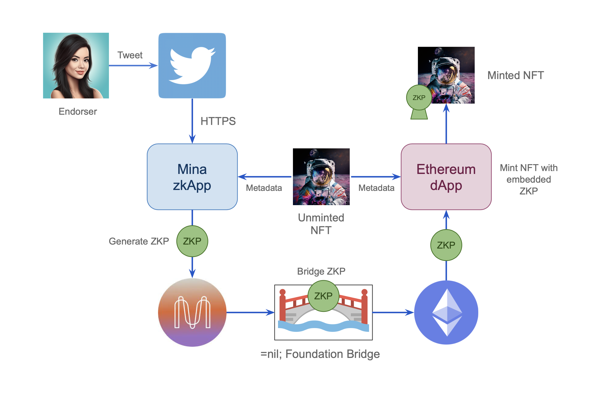
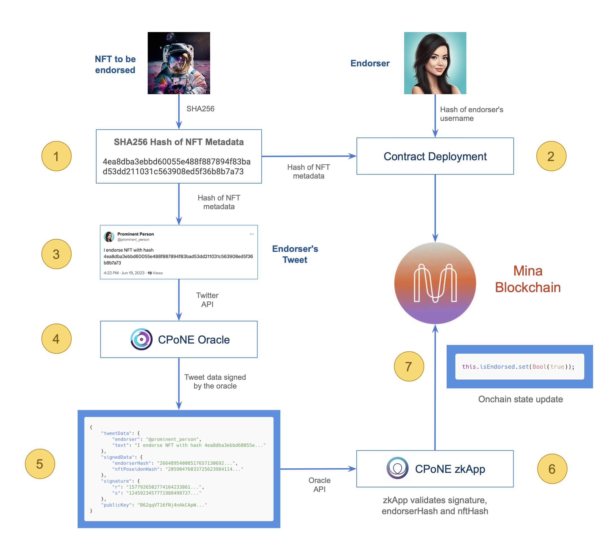

# CPoNE - Cryptographic Proof of NFT Endorsement

## Introduction

Verifying the authenticity of an NFT endorsement by a prominent person can be challenging. To address this issue, we propose CPoNE (pronounced see-poh-nee), a method for achieving this verification by deploying a zkApp on the Mina blockchain. This app generates a proof of the endorsement's authenticity and then bridges it to Ethereum, where the NFT is minted.

In this method, we use Twitter as an "identity provider" since it is a widely-used and popular service. However, any similar service that uses the HTTPS protocol could be used instead.

## Problem Statement

The perceived value of an NFT (or any collectible, for that matter) depends on several factors, including rarity, historical significance, popularity, and authenticity.

Let's use an example of an NFT that commemorates the arrival of the human race on the moon. Anyone could create some art related to this occasion (especially now with the help of generative art tools), then mint the NFT and put it up for sale on OpenSea. However, what would the value of something like this be? It would most likely be worthless because it lacks authenticity.

## Solution

Building on the previous example, imagine if we could convince someone who actually participated in the moon landing to endorse the NFT. An ideal candidate for this would be Dr. Buzz Aldrin, the only astronaut from the Apollo 11 mission who is still with us. Let's assume we contact him and he agrees to endorse the NFT. How can we cryptographically prove that he has actually endorsed the NFT?
Asking Dr. Aldrin, who is a senior citizen at 93 years old, to install Metamask, create an Ethereum wallet address, and sign a cryptographic transaction is not an ideal approach. Even if he was able to do that, what does that really prove? Anyone could do it and then claim it was Dr. Aldrin who did it. We need a better way to tie Dr. Aldrin's online identity with the NFT.

What if we instead asked Dr. Aldrin to tweet a specific text containing information about the NFT, such as a hash of some of the metadata? We could then use a zkApp to generate a zero-knowledge proof verifying that the account @TheRealBuzz tweeted the hash. We could then bridge this ZKP from the Mina blockchain to Ethereum, add it to the NFT metadata, and finally mint the NFT.
This will eliminate any doubt regarding the authenticity of the NFT, ensuring that its value accurately reflects this fact. Furthermore, even if the tweet is deleted or the account closed in the future, the ZKP will act as a "cryptographic screenshot" of the endorsement.

The following diagram describes the solution at a conceptual level.



# Implementation

In regards to the implementation, we have divided the problem in three separate components:

1. zkOracle
2. Proof generation
3. Proof bridging

## 1. zkOracle

The zkOracle component plays a crucial role in our project by providing a solution to consume data from the Twitter's API without relying on trust assumptions about the data's integrity. However, it is important to note that achieving this goal is a challenging task and an active area of research in the field of cryptography.

The difficulty arises from the nature of the TLS (Transport Layer Security) protocol, which employs symmetric encryption and authentication keys shared between the HTTPS client and server. This characteristic introduces the possibility of the client forging arbitrary TLS session data, making it impossible to trustlessly assume that the data obtained from the zkOracle hasn't been tampered with.

To address this problem, several solutions have emerged, such as [DECO](https://deco.works) and [TLSNotary](https://tlsnotary.org). These systems adopt a similar approach by introducing a third-party entity known as a "notary." The client and the notary engage in a multi-party computation (MPC) that enables them to generate the encryption and authentication keys for the TLS session, without either party having direct knowledge of these keys.

As a result, the client becomes capable of retrieving data from the HTTPS server without possessing the authentication key, thereby establishing a trustable mechanism for verifying the integrity of the data obtained from the web server.

After extensive discussions with several people from the Mina Foundation and O(1) Labs, as well as our mentors, we have collectively determined that implementing a trustless zkOracle component would be a substantial undertaking for our current project scope. Therefore, for the purposes of our proof of concept, we have decided to make the assumption that the data provided by the oracle is valid. However, we acknowledge that developing a trustless zkOracle remains a potential area for future improvement and exploration.

To simulate the functionality of a zkOracle, we have developed a lightweight Express.js server. This server serves as a mocked zkOracle and exposes a single API endpoint. By providing the Twitter handle as a parameter, the endpoint retrieves the most recent tweet associated with that handle. The server then extracts the text of the tweet and searches for a corresponding hash. If a hash is found, a JSON object with the tweet data is returned, along with a digital signature; otherwise, an error is generated. You can find the project's GitHub repository at https://github.com/racampos/cpone-oracle. Additionally, we have deployed the server on Heroku, and you can access the endpoint at https://cpone-oracle-aa6cba0bb20a.herokuapp.com.

## 2. Proof generation

To generate the proof of the endorsement on the Mina blockchain, we developed a zkApp consisting of a [smart contract](src/Cpone.ts) with four state variables and one `verify()` method.

The CPoNE zkApp smart contract contains the following on-chain state variables:
* `oraclePublicKey`: stores the public key of our trusted data provider (the oracle).
* `nftHash`: Poseidon hash of the SHA256 hash of the NFT metadata.
* `endorserHash`: Poseidon hash of the endorser's Twitter username.
* `isEndorsed`: boolean flag that's set to true when the `verify()` function on the zkApp is run and successfully validates that the data retrieved from the oracle matches the data on-chain.

The following diagram illustrates the flow of the endorsement process, up until the point where the proof is generated and the Mina state is updated accordingly:



Here is a breakdown of each of the steps involved in the process:

* Step 1: First, we compute the SHA256 hash by processing the metadata of the NFT that needs to be endorsed.
* Step 2: The smart contract for the CPoNE zkApp is deployed to the Mina Blockchain. The hash of the NFT metadata and the hash of the prominent person's Twitter username are used to initialize the contract's state variables.
* Step 3: The prominent person (endorser) sends a tweet from their Twitter account that includes the hash calculated in step 1.
* Step 4: Using the public Twitter API, an [oracle](https://github.com/racampos/cpone-oracle) fetches the tweet sent by the endorser in step 3.
* Step 5: The oracle computes the Poseidon hash for both the endorser's username and the SHA256 hash, using a Mina-compatible private key. It then returns the hashed data, signature and public key as a JSON object.
* Step 6: The CPoNE zkApp takes the data retrieved from the oracle API and uses its `verify()` method to validate that the signature is valid, as well as that the endorser's username hash and the NFT hash correspond to the values previously commited on chain.
* Step 7: If everything checks, the zkApp then updates the state of the Mina blockchain by setting the `isEndorsed` boolean state variable to `true`.


## 3. Proof Bridging

Once the proof has been generated and the `isEndorsed` boolean state variable has been set to `true`, the next step is to mint the NFT on Ethereum (or any other EVM-based blockchain). However, in order to establish the authenticity of the NFT endorsement, it is crucial to verify the validity of the Mina proof on the EVM chain. This requires implementing a mechanism to bridge the proof from Mina to the EVM chain.

At present, this aspect of the project is still in the research phase. We are actively exploring various approaches and evaluating potential solutions to ensure a secure and reliable bridging process.

## Setup & Usage

Make sure to have Node.js and npm installed.

Clone this repository and then install the dependencies:

```sh
git clone https://github.com/racampos/cpone.git
cd cpone
npm install
```

To build the project, run:

`npm run build`

You can run the tests with:

`npm run test`

## Future work

Our current system relies on trusting the oracle. A potential improvement would be to implement a cryptographic scheme to ensure the authenticity and integrity of the data fetched from Twitter. This would involve a system that can generate an unforgeable commitment of the TLS session data, verify that this data is authentically from the Twitter server, while preserving the security and privacy assumptions of TLS.
See the section on Future Work in the [cpone-oracle](https://github.com/racampos/cpone-oracle/blob/main/README.md) repository.

License

This project is licensed under the [Apache-2.0](LICENSE) License.